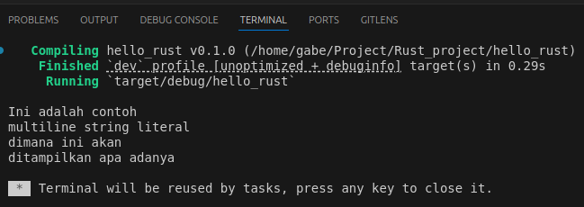
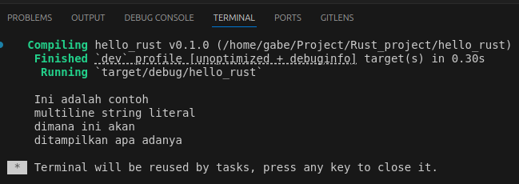

# Tipe data -> String Literal `&str`

### String Literal atau `&str`
apa itu `&str`? tipe `str` merupakan tipe primitif yang ada di rust. Penulisan `&str` menandakan bahwa tipe tersebut adalah pointer `str`
```rust
fn main(){
    let var: &str = "Hello Worlds";
    println!("{}",var);
}
```

### Escape karakter menggunakan `\`
Pada string biasanya kita mungkin saja ingin menggunakan tanda `"` dalam string, namun kita tidak bisa secara langsung memasukkannya karena compiler mungkin akan mengira itu adalah penutup dari sebuah string. Karena itu kita perlu meng-*escape* karakter `"` menggunakan `\`
```rust
let var: &str = "Hallo nama saya \"Gabe\"";
// output Hallo nama saya "Gabe"
```

### Multiline String Literal
Penulisan multiline string di Rust adalah sama seperti penulisan biasa, yaitu langsung saja tulis string dengan diapit `"`
```rust
    let var_string: &str = "
Ini adalah contoh
multiline string literal
dimana ini akan
ditampilkan apa adanya
";

    println!("{}", var_string);
```


Bisa dilihat pada kode penulisan string dilakukan dari bagian paling kiri, jika dilakukan seperti ini..
```rust
    let var_string: &str = "
    Ini adalah contoh
    multiline string literal
    dimana ini akan
    ditampilkan apa adanya
    ";

    println!("{}", var_string);
```
maka hasilnya akan seperti ini



### Raw string
Jika sebelumnya kita menggunakan `\` untuk *escape* karakter maka ada cara lain yang bisa lakukan yaitu menggunakan Raw string. Raw string di tunjukkan dengan penulisan string yang diapit oleh `r#"` dan ditutup dengan `"#`.
```rust
let var = r#"
    {
        "name": "tim drake",
        "gender": "male"
    }
"#;
println!("{}",var);
```
